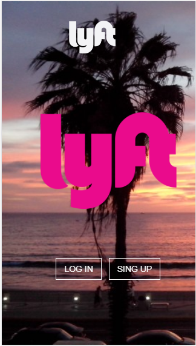

## Lyft WebApp

lyft es una webApp, relacionado mas a los usuarios que solicitan servicio de autos o taxis.En la cual se nos pidio desarrollar como parte de nuestro retos de codigo en Laboratoria y parte del reto consiste en  dar  la interaccion entre web e usuario. 

La finalidad de lyft se basa en solicitar al usuario  sus datos a traves de los formularios de la webApp que por media de ella tambien obliga al usuario completar todos los campos de datos y asi poder brindar un servicio mas seguro. 

#### Algunas vistas de la aplicacion

### Desarrollado 

[Laboratoria](http://laboratoria.la).

